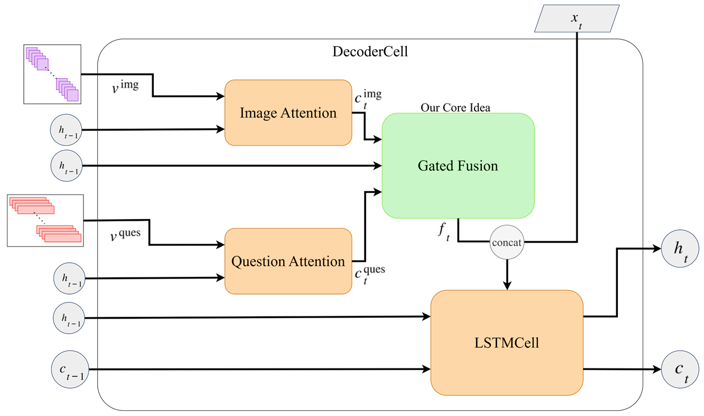
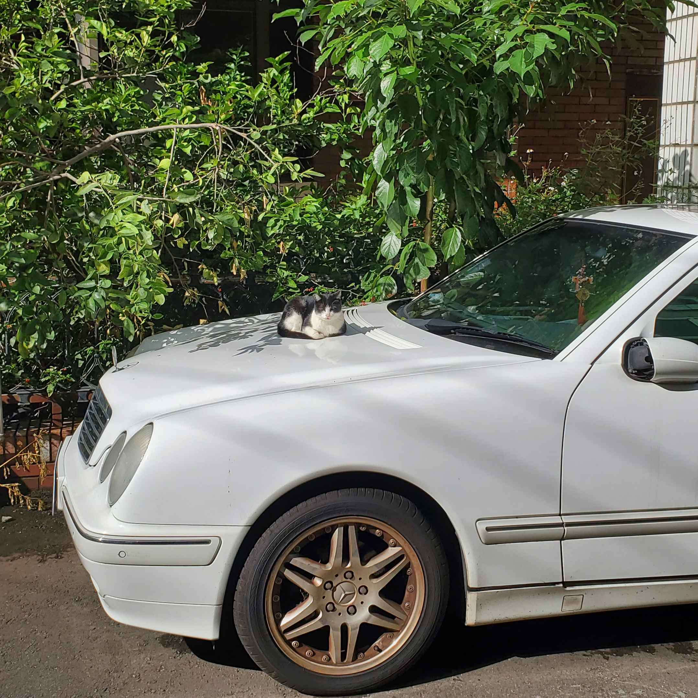

# DAMM: Dual Attention Multimodal Model for VQA

## Abstract

This project explores a modular architecture for Visual Question Answering (VQA) that integrates visual and textual modalities using attention and gated fusion mechanisms. We leverage a frozen CLIP-ResNet backbone to extract fine-grained image features, a BiLSTM to encode textual questions, and an LSTM decoder that generates answers token-by-token. At each decoding step, the model selectively attends to relevant regions of the image and important words in the question, then fuses these signals to inform answer generation. We train and evaluate on the LLaVA 150K dataset, which contains rich, open-ended instruction-style questions and answers. Our design emphasizes modularity, interpretability, and flexible reasoning over both modalities. We show examples where the model aligns attention with relevant image regions and question tokens, demonstrating effective multimodal understanding.

## Introduction

Visual Question Answering (VQA) requires models to reason jointly over visual and textual inputs to generate answers. Traditional approaches either use joint embeddings or encode both inputs without explicit alignment. We propose a modular VQA model that emphasizes interpretability and flexibility. Inspired by CLIP’s strong vision encoder and the sequential nature of question answering, we combine a CLIP-ResNet image backbone, a BiLSTM question encoder, and a stepwise decoder with gated attention and fusion. This architecture supports detailed multimodal alignment and generation, and serves as a strong, extensible baseline for future VQA research.

---

## Architecture Overview

### 1. Image Encoder: `CLIPResNetImageFeatureEncoder`

- Extracts spatial feature maps from input image using a CLIP ResNet (e.g., RN101).
- Output shape: `[B, C=2048, H, W]`

### 2. Question Encoder: `BiLSTMQuestionEncoder`

- Encodes tokenized questions using a bidirectional LSTM.
- Output shape: `[B, T_q, 2 × hidden_dim]`

### 3. Attention Modules

#### `ImageAttention`

- Computes attention over image feature grid.
- Produces weighted visual context vector: `[B, C]`

#### `QuestionAttention`

- Computes attention over question tokens.
- Produces weighted textual context vector: `[B, 2 × hidden_dim]`

### 4. Gated Fusion: `GatedFusionModule`

- Fuses visual and textual contexts with a learned gate based on decoder state.
- Output: `[B, D]`

### 5. Decoder: `MultimodalDecoderLSTM`

- Combines word embeddings and fused context to decode next token.
- Generates output logits at each time-step.


### 6. Full Pipeline: `MultimodalVQAModel`

```text
Input:
  ├── Image: [B, 3, H, W]
  └── Question: [B, T_q] (token IDs)

1. Encode image and question
2. Initialize decoder from image features
3. For each step in the answer sequence:
   ├── Attend to image
   ├── Attend to question
   ├── Gated fusion of both contexts
   ├── LSTM step and token prediction

Output:
  └── Generated answer token sequence
```

## Dataset

We use [LLaVA 150K](https://github.com/haotian-liu/LLaVA) dataset: a large-scale instruction-following VQA dataset with image-question-answer triples.

## Acknowledgements

* [CLIP](https://openai.com/research/clip)
* [LLaVA](https://github.com/haotian-liu/LLaVA)
* [PyTorch](https://pytorch.org/)

## Install dependencies
CUDA version: `CUDA 11.8`

```bash
pip install -r requirements.txt 
```

## Train

```bash
python3 DAMM.py --checkpoint_path ./checkpoints/damm_epoch{k}.pt
```

## Test
```python
image_pth="./assets/test_car_cat.jpg"
question = "Is there an animal in the image? What is it doing?"
gen, image_log, question_log, gate_log = get_seqs(
                                model, 
                                tokenizer,
                                image_pth, 
                                question
                                )
cap=tokenizer.decode(gen[0])
visualize_attention(image_pth, image_log, cap, encoded_image_size=14, k=5)
```


